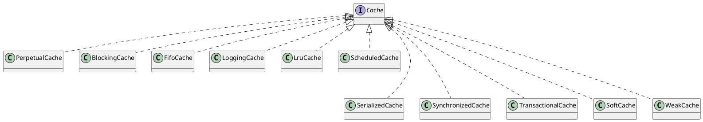

org.apache.ibatis.cache

## package
```
decorators              装饰器模式
    BlockingCache           ReentrantLock
    FifoCache               先进先出
    LoggingCache            记录日志的缓存，记录命中次数和访问次数
    LruCache                近期最少使用
    ScheduledCache          周期性清除缓存的装饰器
    SerializedCache         对象序列化
    SynchronizedCache       同步的
    TransactionalCache      
    SoftCache               软引用
    WeakCache               弱引用
impl
    PerpetualCache          KV键值
Cache
CacheException
CacheKey
NullCacheKey
TransactionalCacheManager
```

## overview
