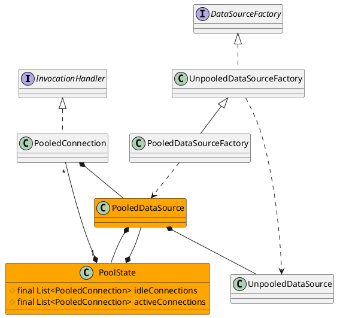

org.apache.ibatis.datasource

## package
```
jndi
    JndiDataSourceFactory
pooled
    PooledConnection
    PooledDataSource
    PooledDataSourceFactory
    PoolState
unpooled
    UnpooledDataSource
    UnpooledDataSourceFactory
DataSourceException                 数据源异常，运行期异常
DataSourceFactory                   工厂模式
```

## overview
* PooledConnection 实现了InvocationHandler
* PooledDataSource
  * 聚合UnpooledDataSource 数据库驱动、链接属性
  * 聚合PoolState 持有池化链接，放到ArrayList里边
  * synchronized(PoolState)
  * finalize() 清理资源forceCloseAll()
  
