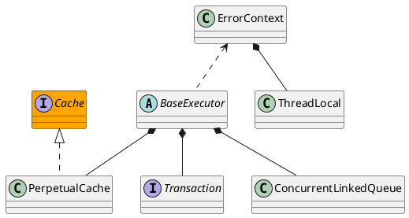

org.apache.ibatis.executor.BaseExecutor

* ConcurrentLinkedQueue 基于Unsafe.cas，而不是ReentrantLock
* 模板方法模式

## hierarchy
```
BaseExecutor (org.apache.ibatis.executor)
    SimpleExecutor (org.apache.ibatis.executor)
    ClosedExecutor in ResultLoaderMap (org.apache.ibatis.executor.loader)
    ReuseExecutor (org.apache.ibatis.executor)
    BatchExecutor (org.apache.ibatis.executor)
```
## define


```java
public abstract class BaseExecutor implements Executor {

  private static final Log log = LogFactory.getLog(BaseExecutor.class);

  protected Transaction transaction;
  protected Executor wrapper;

  protected ConcurrentLinkedQueue<DeferredLoad> deferredLoads;
  protected PerpetualCache localCache;
  protected PerpetualCache localOutputParameterCache;
  protected Configuration configuration;

  protected int queryStack;
  private boolean closed;
}  
```

## methods
* <E> List<E> queryFromDatabase(MappedStatement ms, Object parameter, RowBounds rowBounds, ResultHandler resultHandler, CacheKey key, BoundSql boundSql)
* abstract int doUpdate(MappedStatement ms, Object parameter)
* abstract <E> List<E> doQuery(MappedStatement ms, Object parameter, RowBounds rowBounds, ResultHandler resultHandler, BoundSql boundSql)
* abstract <E> Cursor<E> doQueryCursor(MappedStatement ms, Object parameter, RowBounds rowBounds, BoundSql boundSql)

### query
```java
  @Override
  public <E> List<E> query(MappedStatement ms, Object parameter, RowBounds rowBounds, ResultHandler resultHandler) throws SQLException {
    BoundSql boundSql = ms.getBoundSql(parameter);
    CacheKey key = createCacheKey(ms, parameter, rowBounds, boundSql); // 一级缓存 构造缓存key
    return query(ms, parameter, rowBounds, resultHandler, key, boundSql);
  }
 
 
  @Override
  public <E> List<E> query(MappedStatement ms, Object parameter, RowBounds rowBounds, ResultHandler resultHandler, CacheKey key, BoundSql boundSql) throws SQLException {
    ErrorContext.instance().resource(ms.getResource()).activity("executing a query").object(ms.getId());
    if (closed) {
      throw new ExecutorException("Executor was closed.");
    }
    if (queryStack == 0 && ms.isFlushCacheRequired()) {
      clearLocalCache();
    }
    List<E> list;
    try {
      queryStack++;
      list = resultHandler == null ? (List<E>) localCache.getObject(key) : null; // PerpetualCache localCache 一级缓存
      if (list != null) {
        handleLocallyCachedOutputParameters(ms, key, parameter, boundSql);
      } else {
        list = queryFromDatabase(ms, parameter, rowBounds, resultHandler, key, boundSql);
      }
    } finally {
      queryStack--;
    }
    if (queryStack == 0) {
      for (DeferredLoad deferredLoad : deferredLoads) {
        deferredLoad.load();
      }
      // issue #601
      deferredLoads.clear();
      if (configuration.getLocalCacheScope() == LocalCacheScope.STATEMENT) {
        // issue #482
        clearLocalCache();
      }
    }
    return list;
  }
```

### queryFromDatabase
Cache-Aside
```java
  private <E> List<E> queryFromDatabase(MappedStatement ms, Object parameter, RowBounds rowBounds, ResultHandler resultHandler, CacheKey key, BoundSql boundSql) throws SQLException {
    List<E> list;
    localCache.putObject(key, EXECUTION_PLACEHOLDER);
    try {
      list = doQuery(ms, parameter, rowBounds, resultHandler, boundSql);
    } finally {
      localCache.removeObject(key);
    }
    localCache.putObject(key, list); // 一级缓存，将每次查询结果直接写入二级缓存。区分二级缓存
    if (ms.getStatementType() == StatementType.CALLABLE) {
      localOutputParameterCache.putObject(key, parameter);
    }
    return list;
  }
```