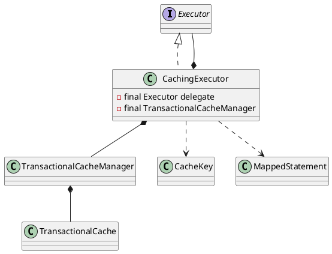

org.apache.ibatis.executor.CachingExecutor

## define


```java
public class CachingExecutor implements Executor {

  private final Executor delegate;
  private final TransactionalCacheManager tcm = new TransactionalCacheManager();

}  
```

## methods

### query
```java
  @Override
  public <E> List<E> query(MappedStatement ms, Object parameterObject, RowBounds rowBounds, ResultHandler resultHandler) throws SQLException {
    BoundSql boundSql = ms.getBoundSql(parameterObject);
    CacheKey key = createCacheKey(ms, parameterObject, rowBounds, boundSql);
    return query(ms, parameterObject, rowBounds, resultHandler, key, boundSql);
  }
  
  @Override
  public <E> List<E> query(MappedStatement ms, Object parameterObject, RowBounds rowBounds, ResultHandler resultHandler, CacheKey key, BoundSql boundSql)
      throws SQLException {
    Cache cache = ms.getCache(); // 二级缓存 mapper级别的缓存
    if (cache != null) {
      flushCacheIfRequired(ms);
      if (ms.isUseCache() && resultHandler == null) {
        ensureNoOutParams(ms, parameterObject, boundSql);
        @SuppressWarnings("unchecked")
        List<E> list = (List<E>) tcm.getObject(cache, key); // 事务缓存
        if (list == null) {
          list = delegate.<E> query(ms, parameterObject, rowBounds, resultHandler, key, boundSql);
          tcm.putObject(cache, key, list); // issue #578 and #116
        }
        return list;
      }
    }
    return delegate.<E> query(ms, parameterObject, rowBounds, resultHandler, key, boundSql);
  }
```

### commit
```java
  @Override
  public void commit(boolean required) throws SQLException {
    delegate.commit(required);
    tcm.commit();
  }
  
  // org.apache.ibatis.cache.TransactionalCacheManager.commit
  // 事务提交时，将数据写入二级缓存。防止出现“脏读”（读未提交）的情况，最终实现的效果类似于“不可重复读”（读已提交）。区分一级缓存
  public void commit() {
    for (TransactionalCache txCache : transactionalCaches.values()) {
      txCache.commit();
    }
  }
```
