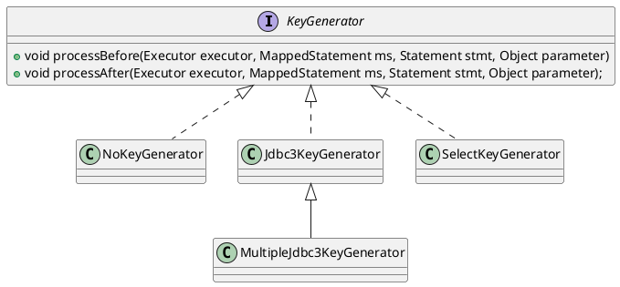

org.apache.ibatis.executor.keygen.KeyGenerator

## hierarchy
```
KeyGenerator (org.apache.ibatis.executor.keygen)
    NoKeyGenerator (org.apache.ibatis.executor.keygen)
    Jdbc3KeyGenerator (org.apache.ibatis.executor.keygen)
        MultipleJdbc3KeyGenerator (com.github.abel533.mapperhelper)
    SelectKeyGenerator (org.apache.ibatis.executor.keygen)
```

## define
