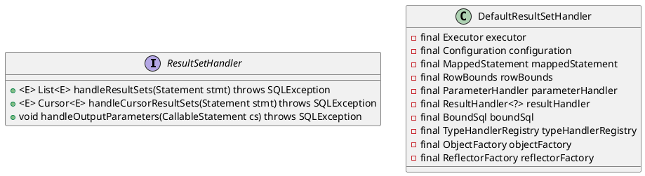

org.apache.ibatis.executor.resultset.ResultSetHandler

## hierarchy
```
ResultSetHandler (org.apache.ibatis.executor.resultset)
    DefaultResultSetHandler (org.apache.ibatis.executor.resultset)
```
## define



## methods

### handleResultSets
```java
  @Override
  public List<Object> handleResultSets(Statement stmt) throws SQLException {
    ErrorContext.instance().activity("handling results").object(mappedStatement.getId());

    final List<Object> multipleResults = new ArrayList<Object>();

    int resultSetCount = 0;
    ResultSetWrapper rsw = getFirstResultSet(stmt);

    List<ResultMap> resultMaps = mappedStatement.getResultMaps();
    int resultMapCount = resultMaps.size();
    validateResultMapsCount(rsw, resultMapCount);
    while (rsw != null && resultMapCount > resultSetCount) {
      ResultMap resultMap = resultMaps.get(resultSetCount);
      handleResultSet(rsw, resultMap, multipleResults, null);
      rsw = getNextResultSet(stmt);
      cleanUpAfterHandlingResultSet();
      resultSetCount++;
    }

    String[] resultSets = mappedStatement.getResultSets();
    if (resultSets != null) {
      while (rsw != null && resultSetCount < resultSets.length) {
        ResultMapping parentMapping = nextResultMaps.get(resultSets[resultSetCount]);
        if (parentMapping != null) {
          String nestedResultMapId = parentMapping.getNestedResultMapId();
          ResultMap resultMap = configuration.getResultMap(nestedResultMapId);
          handleResultSet(rsw, resultMap, null, parentMapping);
        }
        rsw = getNextResultSet(stmt);
        cleanUpAfterHandlingResultSet();
        resultSetCount++;
      }
    }

    return collapseSingleResultList(multipleResults);
  }
  
  private List<Object> collapseSingleResultList(List<Object> multipleResults) {
    return multipleResults.size() == 1 ? (List<Object>) multipleResults.get(0) : multipleResults;
  }
    
```
