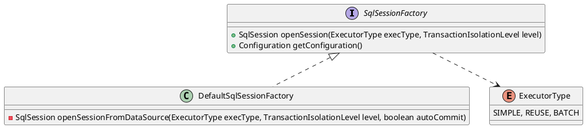
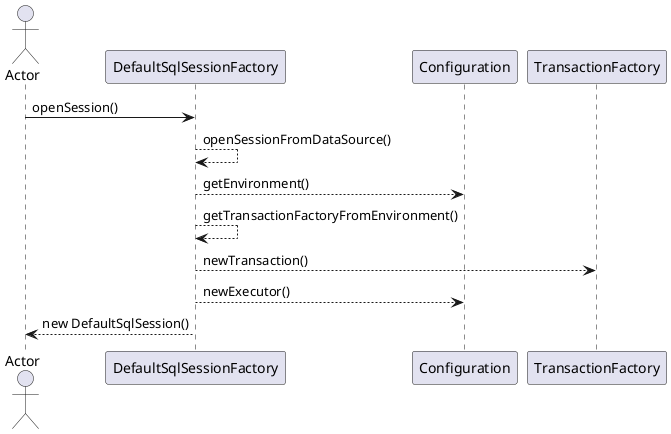

org.apache.ibatis.session.SqlSessionFactory

## hierarchy
```
SqlSessionFactory (org.apache.ibatis.session)
    DefaultSqlSessionFactory (org.apache.ibatis.session.defaults)
    SqlSessionManager (org.apache.ibatis.session)
```

## define



## openSessionFromDataSource
