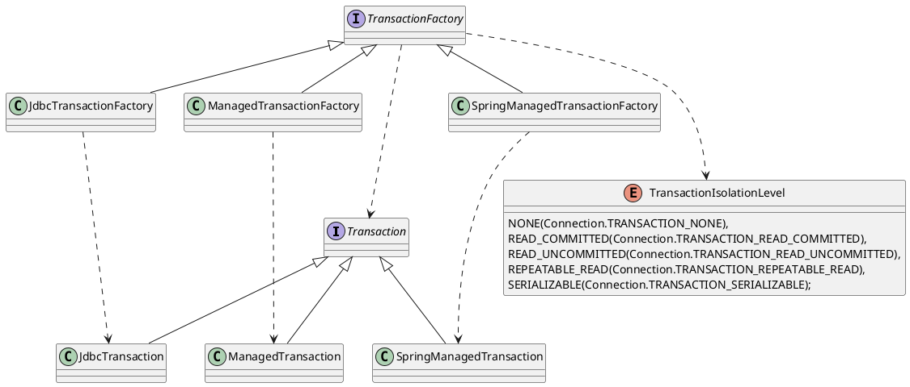

## overview

```plantuml
@startuml

''''''''''''''''' 产品 '''''''''''''''''''
interface Transaction

class JdbcTransaction
class ManagedTransaction
class SpringManagedTransaction

Transaction <|-- JdbcTransaction
Transaction <|-- ManagedTransaction
Transaction <|-- SpringManagedTransaction

''''''''''''''''' 工厂 '''''''''''''''''''
interface TransactionFactory

class JdbcTransactionFactory
class ManagedTransactionFactory
class SpringManagedTransactionFactory

TransactionFactory <|-- JdbcTransactionFactory
TransactionFactory <|-- ManagedTransactionFactory
TransactionFactory <|-- SpringManagedTransactionFactory

''''''''''''''''' 工厂、产品依赖 '''''''''''''''''''
TransactionFactory -.-> Transaction

JdbcTransactionFactory -.-> JdbcTransaction
ManagedTransactionFactory -.-> ManagedTransaction
SpringManagedTransactionFactory -.-> SpringManagedTransaction

enum TransactionIsolationLevel {
  NONE(Connection.TRANSACTION_NONE),
  READ_COMMITTED(Connection.TRANSACTION_READ_COMMITTED),
  READ_UNCOMMITTED(Connection.TRANSACTION_READ_UNCOMMITTED),
  REPEATABLE_READ(Connection.TRANSACTION_REPEATABLE_READ),
  SERIALIZABLE(Connection.TRANSACTION_SERIALIZABLE);
}
TransactionFactory -.-> TransactionIsolationLevel

@enduml
```