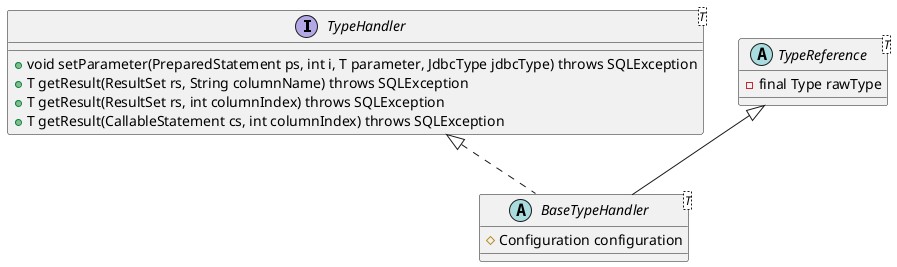

org.apache.ibatis.type.TypeHandler

## hierarchy
```
TypeHandler (org.apache.ibatis.type)
    BaseTypeHandler (org.apache.ibatis.type)
        NClobTypeHandler (org.apache.ibatis.type)
        EnumTypeHandler (com.baomidou.mybatisplus.extension.handlers)
        ClobReaderTypeHandler (org.apache.ibatis.type)
        OffsetTimeTypeHandler (org.apache.ibatis.type)
        ByteObjectArrayTypeHandler (org.apache.ibatis.type)
        DateOnlyTypeHandler (org.apache.ibatis.type)
        BlobTypeHandler (org.apache.ibatis.type)
        DateTypeHandler (org.apache.ibatis.type)
        IntegerTypeHandler (org.apache.ibatis.type)
        SqlTimeTypeHandler (org.apache.ibatis.type)
        NStringTypeHandler (org.apache.ibatis.type)
        CharacterTypeHandler (org.apache.ibatis.type)
        ArrayTypeHandler (org.apache.ibatis.type)
        EnumOrdinalTypeHandler (org.apache.ibatis.type)
        StringTypeHandler (org.apache.ibatis.type)
        BigDecimalTypeHandler (org.apache.ibatis.type)
        BooleanTypeHandler (org.apache.ibatis.type)
        SqlTimestampTypeHandler (org.apache.ibatis.type)
        BlobInputStreamTypeHandler (org.apache.ibatis.type)
        BlobByteObjectArrayTypeHandler (org.apache.ibatis.type)
        EnumTypeHandler (org.apache.ibatis.type)
        MonthTypeHandler (org.apache.ibatis.type)
        FloatTypeHandler (org.apache.ibatis.type)
        TimeOnlyTypeHandler (org.apache.ibatis.type)
        ByteTypeHandler (org.apache.ibatis.type)
        YearMonthTypeHandler (org.apache.ibatis.type)
        InstantTypeHandler (org.apache.ibatis.type)
        ObjectTypeHandler (org.apache.ibatis.type)
        EnumAnnotationTypeHandler (com.baomidou.mybatisplus.extension.handlers)
        ClobTypeHandler (org.apache.ibatis.type)
        DoubleTypeHandler (org.apache.ibatis.type)
        ShortTypeHandler (org.apache.ibatis.type)
        LongTypeHandler (org.apache.ibatis.type)
        LocalDateTypeHandler (org.apache.ibatis.type)
        UnknownTypeHandler (org.apache.ibatis.type)
        BigIntegerTypeHandler (org.apache.ibatis.type)
        ByteArrayTypeHandler (org.apache.ibatis.type)
        OffsetDateTimeTypeHandler (org.apache.ibatis.type)
        JapaneseDateTypeHandler (org.apache.ibatis.type)
        LocalDateTimeTypeHandler (org.apache.ibatis.type)
        ZonedDateTimeTypeHandler (org.apache.ibatis.type)
        SqlDateTypeHandler (org.apache.ibatis.type)
        YearTypeHandler (org.apache.ibatis.type)
        LocalTimeTypeHandler (org.apache.ibatis.type)

```

## define

