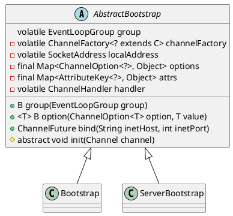

io.netty.bootstrap.AbstractBootstrap

## hierachy
```
AbstractBootstrap (io.netty.bootstrap)
    Bootstrap (io.netty.bootstrap)
    ServerBootstrap (io.netty.bootstrap)
```

## define

```plantuml
@startuml

abstract class AbstractBootstrap {
    volatile EventLoopGroup group
    - volatile ChannelFactory<? extends C> channelFactory
    - volatile SocketAddress localAddress
    - final Map<ChannelOption<?>, Object> options
    - final Map<AttributeKey<?>, Object> attrs
    - volatile ChannelHandler handler
    + B group(EventLoopGroup group)
    + <T> B option(ChannelOption<T> option, T value)
    + ChannelFuture bind(String inetHost, int inetPort)
    # abstract void init(Channel channel)
}

AbstractBootstrap ^-- Bootstrap
AbstractBootstrap ^-- ServerBootstrap

class Bootstrap

class ServerBootstrap


@enduml
```