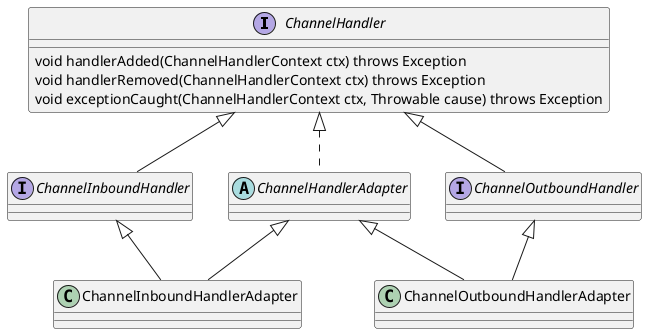

com.alibaba.dubbo.remoting.ChannelHandler

## hierarchy
```
ChannelHandler (io.netty.channel)
    ChannelHandlerAdapter (io.netty.channel)
        ChannelOutboundHandlerAdapter (io.netty.channel)
        Http2FrameLogger (io.netty.handler.codec.http2)
        ChannelInboundHandlerAdapter (io.netty.channel)
    ChannelOutboundHandler (io.netty.channel)
        ChannelDuplexHandler (io.netty.channel)
        SpdyFrameCodec (io.netty.handler.codec.spdy)
        SniHandler (io.netty.handler.ssl)
        ChannelOutboundHandlerAdapter (io.netty.channel)
        SslHandler (io.netty.handler.ssl)
        HeadContext in DefaultChannelPipeline (io.netty.channel)
        HttpClientUpgradeHandler (io.netty.handler.codec.http)
        Http2ConnectionHandler (io.netty.handler.codec.http2)
        WebSocketFrameEncoder (io.netty.handler.codec.http.websocketx)
    ChannelInboundHandler (io.netty.channel)
        ChannelInboundHandlerAdapter (io.netty.channel)
        WebSocketFrameDecoder (io.netty.handler.codec.http.websocketx)
        HeadContext in DefaultChannelPipeline (io.netty.channel)
        TailContext in DefaultChannelPipeline (io.netty.channel)
```

## define
* ChannelInboundHandler
* ChannelOutboundHandler
* ChannelHandlerAdapter

