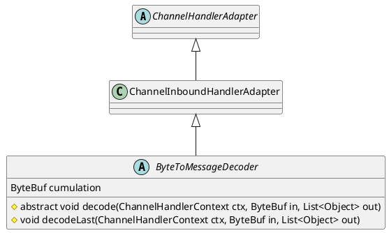

io.netty.handler.codec.ByteToMessageDecoder

## hierarchy
```
ChannelHandlerAdapter (io.netty.channel)
    ChannelInboundHandlerAdapter (io.netty.channel)
        ByteToMessageDecoder (io.netty.handler.codec)
            FixedLengthFrameDecoder (io.netty.handler.codec)
            SslHandler (io.netty.handler.ssl)
            XmlFrameDecoder (io.netty.handler.codec.xml)
            ReplayingDecoder (io.netty.handler.codec)
            JsonObjectDecoder (io.netty.handler.codec.json)
            HttpObjectDecoder (io.netty.handler.codec.http)
            Http2ConnectionHandler (io.netty.handler.codec.http2)
            RedisDecoder (io.netty.handler.codec.redis)
            SpdyFrameCodec (io.netty.handler.codec.spdy)
```

## define
