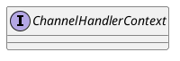

io.netty.channel.ChannelHandlerContext

## hierarchy
```
ChannelHandlerContext (io.netty.channel)
    DelegatingChannelHandlerContext in CombinedChannelDuplexHandler (io.netty.channel)
    AbstractChannelHandlerContext (io.netty.channel)
        HeadContext in DefaultChannelPipeline (io.netty.channel)
        TailContext in DefaultChannelPipeline (io.netty.channel)
        DefaultChannelHandlerContext (io.netty.channel)
```

## define


## fields


## methods