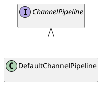

io.netty.channel.DefaultChannelPipeline

## hierarchy
```
DefaultChannelPipeline (io.netty.channel)
    1 in DefaultHttp2StreamChannel in Http2MultiplexCodec (io.netty.handler.codec.http2)
    EmbeddedChannelPipeline in EmbeddedChannel (io.netty.channel.embedded)
DefaultChannelPipeline (io.netty.channel)
    Object (java.lang)
    ChannelPipeline (io.netty.channel)
        ChannelInboundInvoker (io.netty.channel)
        ChannelOutboundInvoker (io.netty.channel)
        Iterable (java.lang)
```

## define


## fields

### 并发
```java

    private static final FastThreadLocal<Map<Class<?>, String>> nameCaches =
            new FastThreadLocal<Map<Class<?>, String>>() {
        @Override
        protected Map<Class<?>, String> initialValue() {
            return new WeakHashMap<Class<?>, String>();
        }
    };

    private static final AtomicReferenceFieldUpdater<DefaultChannelPipeline, MessageSizeEstimator.Handle> ESTIMATOR =
            AtomicReferenceFieldUpdater.newUpdater(
                    DefaultChannelPipeline.class, MessageSizeEstimator.Handle.class, "estimatorHandle");
```

### ChannelHandlerContext
```java
    final AbstractChannelHandlerContext head;
    final AbstractChannelHandlerContext tail;
    
    private final Channel channel;
    private final ChannelFuture succeededFuture;
    private final VoidChannelPromise voidPromise;
    private final boolean touch = ResourceLeakDetector.isEnabled();

    private Map<EventExecutorGroup, EventExecutor> childExecutors;
    private volatile MessageSizeEstimator.Handle estimatorHandle;
    private boolean firstRegistration = true;
```

## methods