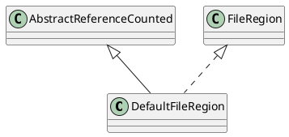

io.netty.channel.DefaultFileRegion
## hierarchy
```
AbstractReferenceCounted (io.netty.util)
    DefaultFileRegion (io.netty.channel)
```

## define


## fields
```java
    private static final InternalLogger logger = InternalLoggerFactory.getInstance(DefaultFileRegion.class);
    private final File f;
    private final long position;
    private final long count;
    private long transferred;
    private FileChannel file;
```

## methods

### transferTo
```java
    @Override
    public long transferTo(WritableByteChannel target, long position) throws IOException {
        long count = this.count - position;
        if (count < 0 || position < 0) {
            throw new IllegalArgumentException(
                    "position out of range: " + position +
                    " (expected: 0 - " + (this.count - 1) + ')');
        }
        if (count == 0) {
            return 0L;
        }
        if (refCnt() == 0) {
            throw new IllegalReferenceCountException(0);
        }
        // Call open to make sure fc is initialized. This is a no-oop if we called it before.
        open();

        long written = file.transferTo(this.position + position, count, target);
        if (written > 0) {
            transferred += written;
        } else if (written == 0) {
            // If the amount of written data is 0 we need to check if the requested count is bigger then the
            // actual file itself as it may have been truncated on disk.
            //
            // See https://github.com/netty/netty/issues/8868
            validate(this, position);
        }
        return written;
    }
```