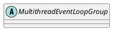

io.netty.channel.MultithreadEventLoopGroup

## hierarchy
```
AbstractEventExecutorGroup (io.netty.util.concurrent)
    MultithreadEventExecutorGroup (io.netty.util.concurrent)
        MultithreadEventLoopGroup (io.netty.channel)
            LocalEventLoopGroup (io.netty.channel.local)
                DefaultEventLoopGroup (io.netty.channel)
            EpollEventLoopGroup (io.netty.channel.epoll)
            NioEventLoopGroup (io.netty.channel.nio)
            KQueueEventLoopGroup (io.netty.channel.kqueue)
        DefaultEventExecutorGroup (io.netty.util.concurrent)
```

## define


## fields

```java
    private static final int DEFAULT_EVENT_LOOP_THREADS;

    static {
        DEFAULT_EVENT_LOOP_THREADS = Math.max(1, SystemPropertyUtil.getInt(
                "io.netty.eventLoopThreads", NettyRuntime.availableProcessors() * 2));

        if (logger.isDebugEnabled()) {
            logger.debug("-Dio.netty.eventLoopThreads: {}", DEFAULT_EVENT_LOOP_THREADS);
        }
    }
```

## methods