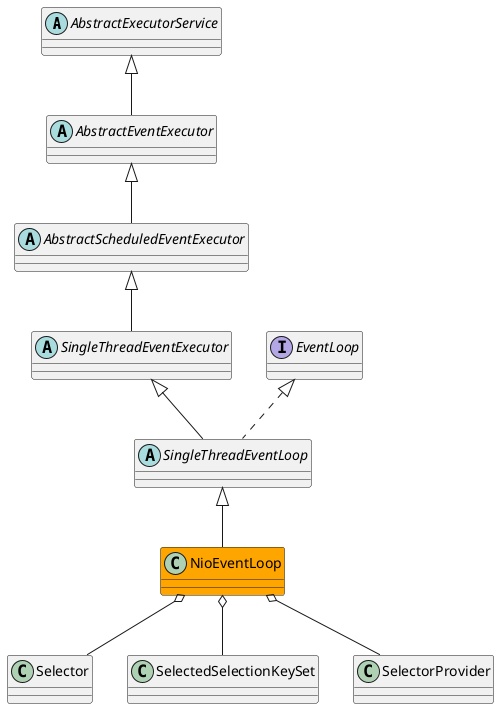

io.netty.channel.nio.NioEventLoop

## hierarchy
```
AbstractExecutorService (java.util.concurrent)
    AbstractEventExecutor (io.netty.util.concurrent)
        AbstractScheduledEventExecutor (io.netty.util.concurrent)
            SingleThreadEventExecutor (io.netty.util.concurrent)
                SingleThreadEventLoop (io.netty.channel)
                    NioEventLoop (io.netty.channel.nio)
```

## define


## methods
### run()
for + select