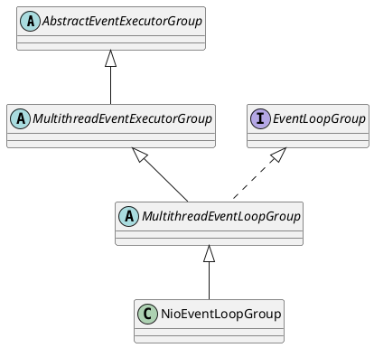

io.netty.channel.nio.NioEventLoopGroup

## hierarchy
```
AbstractEventExecutorGroup (io.netty.util.concurrent)
    MultithreadEventExecutorGroup (io.netty.util.concurrent)
        MultithreadEventLoopGroup (io.netty.channel)
            NioEventLoopGroup (io.netty.channel.nio)
```

## define
