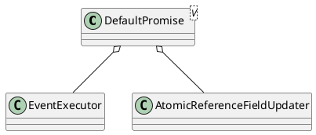

io.netty.util.concurrent.DefaultPromise

* AtomicReferenceFieldUpdater
* synchronized

## hierarchy
```
AbstractFuture (io.netty.util.concurrent)
    DefaultPromise (io.netty.util.concurrent)
        DefaultChannelGroupFuture (io.netty.channel.group)
        PromiseTask (io.netty.util.concurrent)
        ImmediatePromise in ImmediateEventExecutor (io.netty.util.concurrent)
        LazyChannelPromise in SslHandler (io.netty.handler.ssl)
        DefaultChannelPromise (io.netty.channel)
DefaultPromise (io.netty.util.concurrent)
    AbstractFuture (io.netty.util.concurrent)
        Object (java.lang)
        Future (io.netty.util.concurrent)
    Promise (io.netty.util.concurrent)
        Future (io.netty.util.concurrent)
            Future (java.util.concurrent)
```
## define


## methods
### Promise<V> setSuccess(V result)
### notifyListenersNow()

### checkNotifyWaiters()
```
private synchronized boolean checkNotifyWaiters() {
    if (waiters > 0) {
        notifyAll();
    }
    return listeners != null;
}
```

