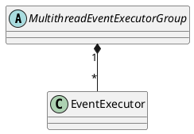

io.netty.util.concurrent.MultithreadEventExecutorGroup

## hierarchy
```
AbstractEventExecutorGroup (io.netty.util.concurrent)
    MultithreadEventExecutorGroup (io.netty.util.concurrent)
        MultithreadEventLoopGroup (io.netty.channel)
            LocalEventLoopGroup (io.netty.channel.local)
                DefaultEventLoopGroup (io.netty.channel)
            EpollEventLoopGroup (io.netty.channel.epoll)
            NioEventLoopGroup (io.netty.channel.nio)
            KQueueEventLoopGroup (io.netty.channel.kqueue)
        DefaultEventExecutorGroup (io.netty.util.concurrent)
```

## define


## fields
```java
    private final EventExecutor[] children;
    private final Set<EventExecutor> readonlyChildren;
    private final AtomicInteger terminatedChildren = new AtomicInteger();
    private final Promise<?> terminationFuture = new DefaultPromise(GlobalEventExecutor.INSTANCE);
    private final EventExecutorChooserFactory.EventExecutorChooser chooser;
```


## methods