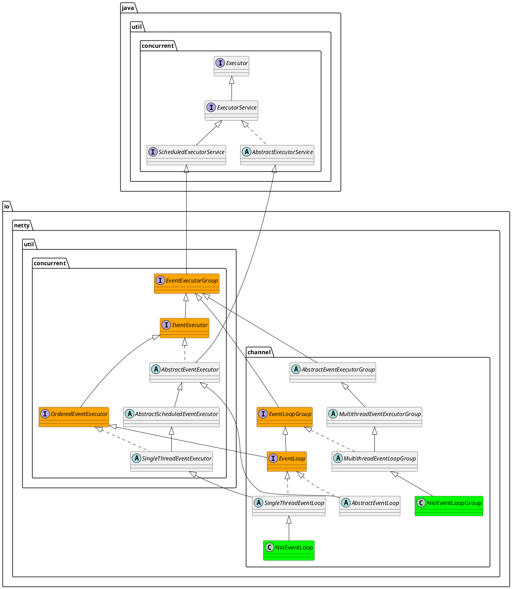

io.netty.util.concurrent.EventExecutor

## hierarchy
```
EventExecutor (io.netty.util.concurrent)
    EventExecutorGroup (io.netty.util.concurrent)
        ScheduledExecutorService (java.util.concurrent)
            ExecutorService (java.util.concurrent)
                Executor (java.util.concurrent)
    Iterable (java.lang)
```

## define
