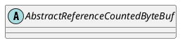

io.netty.buffer.AbstractReferenceCountedByteBuf

## hierarchy
```
ByteBuf (io.netty.buffer)
    AbstractByteBuf (io.netty.buffer)
        AbstractReferenceCountedByteBuf (io.netty.buffer)
            AbstractPooledDerivedByteBuf (io.netty.buffer)
            CompositeByteBuf (io.netty.buffer)
            ReadOnlyByteBufferBuf (io.netty.buffer)
            UnpooledUnsafeDirectByteBuf (io.netty.buffer)
            FixedCompositeByteBuf (io.netty.buffer)
            UnpooledDirectByteBuf (io.netty.buffer)
            PooledByteBuf (io.netty.buffer)
            UnpooledHeapByteBuf (io.netty.buffer)
```

## define


## fields


## methods