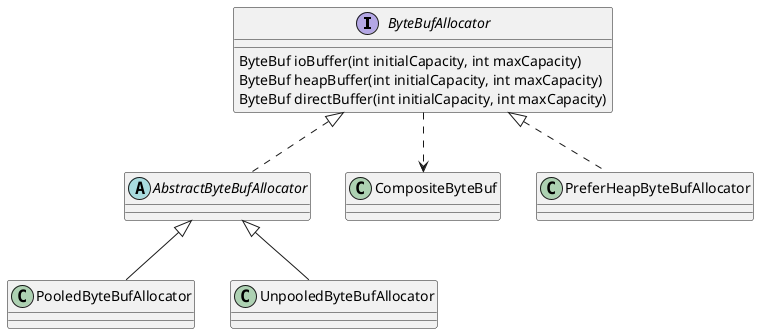

io.netty.buffer.ByteBufAllocator

## hierarchy
```
ByteBufAllocator (io.netty.buffer)
    AbstractByteBufAllocator (io.netty.buffer)
        UnpooledByteBufAllocator (io.netty.buffer)
        PooledByteBufAllocator (io.netty.buffer)
    PreferHeapByteBufAllocator (io.netty.channel)
```

## define
