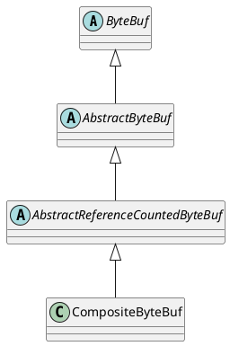

io.netty.buffer.CompositeByteBuf

## hierarchy
```
ByteBuf (io.netty.buffer)
    AbstractByteBuf (io.netty.buffer)
        AbstractReferenceCountedByteBuf (io.netty.buffer)
            CompositeByteBuf (io.netty.buffer)
                WrappedCompositeByteBuf (io.netty.buffer)
```

## define


## fields
```java
private final ByteBufAllocator alloc;
private final boolean direct;
private final int maxNumComponents;

private int componentCount;
private Component[] components; // resized when needed

private boolean freed;
```

## methods