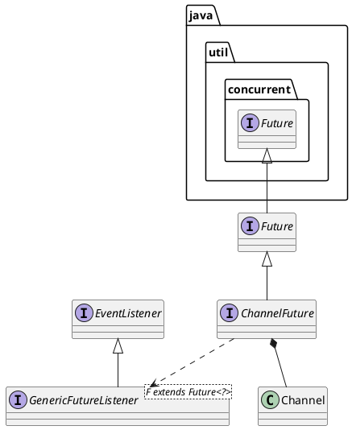

io.netty.channel.ChannelFuture

## hierarchy
```
ChannelFuture (io.netty.channel)
    ChannelProgressiveFuture (io.netty.channel)
    ChannelPromise (io.netty.channel)
    CompleteChannelFuture (io.netty.channel)
```

## define


```java
public interface ChannelFuture extends Future<Void> {

    /**
     * Returns a channel where the I/O operation associated with this
     * future takes place.
     */
    Channel channel();

    @Override
    ChannelFuture addListener(GenericFutureListener<? extends Future<? super Void>> listener);

    @Override
    ChannelFuture addListeners(GenericFutureListener<? extends Future<? super Void>>... listeners);

    @Override
    ChannelFuture removeListener(GenericFutureListener<? extends Future<? super Void>> listener);

    @Override
    ChannelFuture removeListeners(GenericFutureListener<? extends Future<? super Void>>... listeners);

    @Override
    ChannelFuture sync() throws InterruptedException;

    @Override
    ChannelFuture syncUninterruptibly();

    @Override
    ChannelFuture await() throws InterruptedException;

    @Override
    ChannelFuture awaitUninterruptibly();

    boolean isVoid();
}
```
