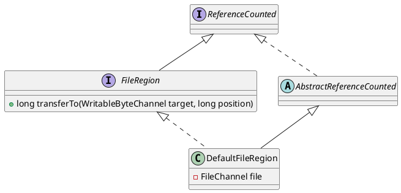

io.netty.channel.FileRegion

## hierachy
```
FileRegion (io.netty.channel)
    DefaultFileRegion (io.netty.channel)
    ManyMessageTransfer (org.apache.rocketmq.broker.pagecache)
    OneMessageTransfer (org.apache.rocketmq.broker.pagecache)
    QueryMessageTransfer (org.apache.rocketmq.broker.pagecache)
```

## define


