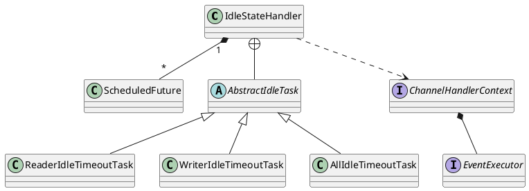

io.netty.handler.timeout.IdleStateHandler

## hierarchy
```
ChannelHandlerAdapter (io.netty.channel)
    ChannelInboundHandlerAdapter (io.netty.channel)
        ChannelDuplexHandler (io.netty.channel)                     duplex 双工 复式 小复式 全双工
            IdleStateHandler (io.netty.handler.timeout)
                ReadTimeoutHandler (io.netty.handler.timeout)

```

## define


```java
    public IdleStateHandler(
            int readerIdleTimeSeconds,
            int writerIdleTimeSeconds,
            int allIdleTimeSeconds) {

        this(readerIdleTimeSeconds, writerIdleTimeSeconds, allIdleTimeSeconds,
             TimeUnit.SECONDS);
    }
```

## fields


## methods