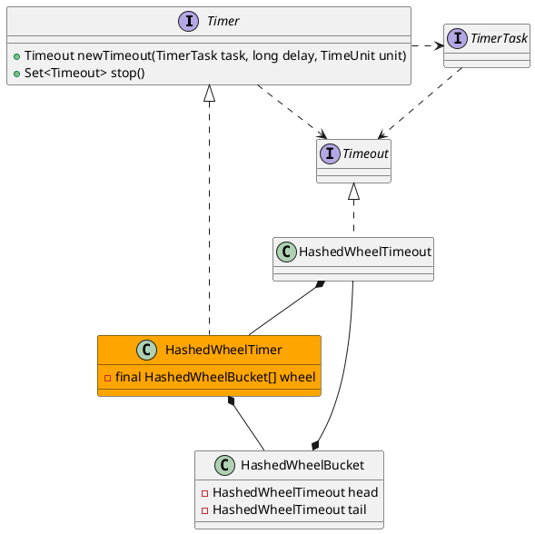

io.netty.util.HashedWheelTimer
- AtomicLong
- CountDownLatch
- PlatformDependent

## Define



```java
public class HashedWheelTimer implements Timer {
    private volatile int workerState; // 0 - init, 1 - started, 2 - shut down

    private final long tickDuration;
    private final HashedWheelBucket[] wheel;
}
```