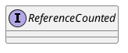

io.netty.util.ReferenceCounted

## hierarchy
```
ReferenceCounted (io.netty.util)
    AbstractReferenceCounted (io.netty.util)
    AddressedEnvelope (io.netty.channel)
    ByteBuf (io.netty.buffer)
    ByteBufHolder (io.netty.buffer)
    DnsMessage (io.netty.handler.codec.dns)
    FileRegion (io.netty.channel)
    InterfaceHttpData (io.netty.handler.codec.http.multipart)
    MemcacheMessage (io.netty.handler.codec.memcache)
    OpenSslKeyMaterial (io.netty.handler.ssl)
    ReferenceCountedOpenSslContext (io.netty.handler.ssl)
    ReferenceCountedOpenSslEngine (io.netty.handler.ssl)
    UpgradeEvent in HttpServerUpgradeHandler (io.netty.handler.codec.http)
```

## define
* retain
* touch
* release

