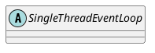

io.netty.util.concurrent.SingleThreadEventExecutor

## hierarchy
```
AbstractExecutorService (java.util.concurrent)                  
    AbstractEventExecutor (io.netty.util.concurrent)                事件执行器
        AbstractScheduledEventExecutor (io.netty.util.concurrent)
            SingleThreadEventExecutor (io.netty.util.concurrent)        单线程事件执行器
                DefaultEventExecutor (io.netty.util.concurrent)
                SingleThreadEventLoop (io.netty.channel)                    单线程事件循环
                    EpollEventLoop (io.netty.channel.epoll)
                    ThreadPerChannelEventLoop (io.netty.channel)
                    DefaultEventLoop (io.netty.channel)
                    NioEventLoop (io.netty.channel.nio)
                    KQueueEventLoop (io.netty.channel.kqueue)
```

## define


## fields


## methods