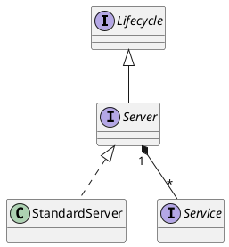

org.apache.catalina.Server

## hierarchy
```
Server (org.apache.catalina)
    StandardServer (org.apache.catalina.core)
Server (org.apache.catalina)
    Lifecycle (org.apache.catalina)
```

## define


```java
public interface Server extends Lifecycle {

    // ------------------------------------------------------------- Properties
    public NamingResourcesImpl getGlobalNamingResources();
    public void setGlobalNamingResources(NamingResourcesImpl globalNamingResources);
    public javax.naming.Context getGlobalNamingContext();
    public int getPort();
    public void setPort(int port);
    public String getAddress();
    public void setAddress(String address);
    public String getShutdown();
    public void setShutdown(String shutdown);
    public ClassLoader getParentClassLoader();
    public void setParentClassLoader(ClassLoader parent);
    public Catalina getCatalina();
    public void setCatalina(Catalina catalina);
    public File getCatalinaBase(); // Tomcat工作目录 conf、logs、temp、webapps和work的父目录
    public void setCatalinaBase(File catalinaBase);
    public File getCatalinaHome(); // Tomcat安装目录 bin和lib的父目录
    public void setCatalinaHome(File catalinaHome);

    // --------------------------------------------------------- Public Methods
    public void addService(Service service);
    public void await();
    public Service findService(String name);
    public Service[] findServices();
    public void removeService(Service service);
    public Object getNamingToken();
}
```
