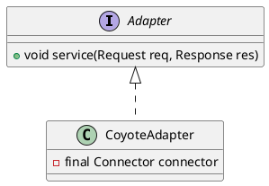
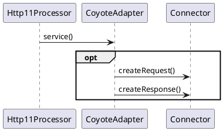

org.apache.catalina.connector.CoyoteAdapter

## define




## service
```
connector.getService().getContainer().getPipeline().getFirst().invoke(request, response)
```

## seq



## methods

### service
```java
    @Override
    public void service(org.apache.coyote.Request req, org.apache.coyote.Response res)
            throws Exception{

    }
```