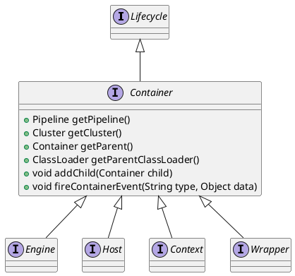

org.apache.catalina.Context

## hierarchy
```
Context (org.apache.catalina)
    FailedContext (org.apache.catalina.startup)
    StandardContext (org.apache.catalina.core)
        TomcatEmbeddedContext (org.springframework.boot.web.embedded.tomcat)
Context (org.apache.catalina)
    Container (org.apache.catalina)
        Lifecycle (org.apache.catalina)
    ContextBind (org.apache.tomcat)
```

## define


## fields


## methods