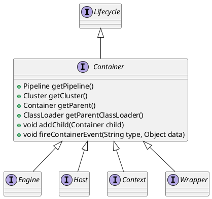

org.apache.catalina.Host
## hierarchy
```
Host (org.apache.catalina)
    StandardHost (org.apache.catalina.core)
Host (org.apache.catalina)
    Container (org.apache.catalina)
        Lifecycle (org.apache.catalina)
```

## define


## fields


## methods