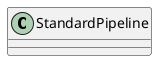

org.apache.catalina.core.StandardPipeline

## hierarchy
```
LifecycleBase (org.apache.catalina.util)
    StandardPipeline (org.apache.catalina.core)
StandardPipeline (org.apache.catalina.core)
    LifecycleBase (org.apache.catalina.util)
        Object (java.lang)
        Lifecycle (org.apache.catalina)
    Pipeline (org.apache.catalina)
    Contained (org.apache.catalina)
```

## define


## fields


## methods