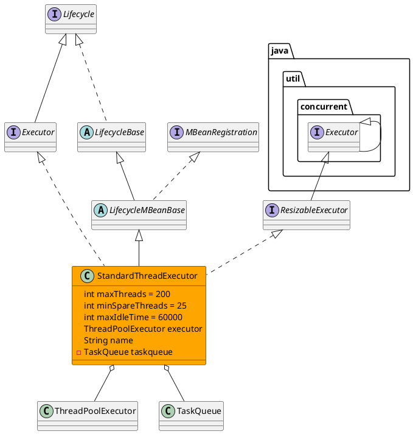

org.apache.catalina.core.StandardThreadExecutor
## hierarchy
```
LifecycleBase (org.apache.catalina.util)
    LifecycleMBeanBase (org.apache.catalina.util)
        StandardThreadExecutor (org.apache.catalina.core)
StandardThreadExecutor (org.apache.catalina.core)
    LifecycleMBeanBase (org.apache.catalina.util)
        LifecycleBase (org.apache.catalina.util)
            Object (java.lang)
            Lifecycle (org.apache.catalina)
        JmxEnabled (org.apache.catalina)
            MBeanRegistration (javax.management)
    Executor (org.apache.catalina)
        Executor (java.util.concurrent)
        Lifecycle (org.apache.catalina)
    ResizableExecutor (org.apache.tomcat.util.threads)
        Executor (java.util.concurrent)
```
## define
