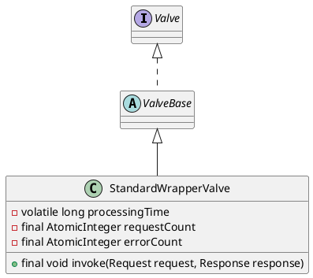

org.apache.catalina.core.StandardWrapperValve

## hierachy
```
LifecycleBase (org.apache.catalina.util)
    LifecycleMBeanBase (org.apache.catalina.util)
        ValveBase (org.apache.catalina.valves)
            StandardWrapperValve (org.apache.catalina.core)
```

## define

