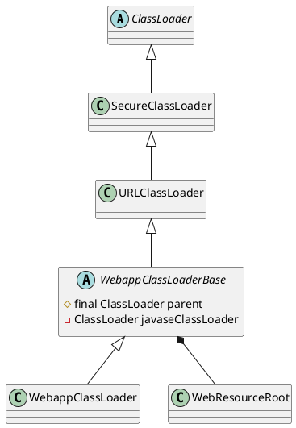

org.apache.catalina.loader.WebappClassLoader

## hierarchy
```
Object (java.lang)
    ClassLoader (java.lang)
        SecureClassLoader (java.security)
            URLClassLoader (java.net)
                WebappClassLoaderBase (org.apache.catalina.loader)
                    WebappClassLoader (org.apache.catalina.loader)
WebappClassLoader (org.apache.catalina.loader)
    WebappClassLoaderBase (org.apache.catalina.loader)
        URLClassLoader (java.net)
            SecureClassLoader (java.security)
                ClassLoader (java.lang)
        Closeable (java.io)
        Lifecycle (org.apache.catalina)
        InstrumentableClassLoader (org.apache.tomcat)
        WebappProperties (org.apache.juli)
        PermissionCheck (org.apache.tomcat.util.security)

```

## define
* ClassLoader parent
* ClassLoader javaseClassLoader




## methods
### loadClass()
重写可破坏双亲委派，继承ClassLoader，重写loadClass()与findClass()

* Call findLoadedClass(String) to check if the class has already been loaded.  If it has, the same Class object is returned.
* If the delegate property is set to true, call the loadClass() method of the parent class loader, if any.
* Call findClass() to find this class in our locally defined repositories.
* Call the loadClass() method of our parent class loader, if any.


Java默认的类加载顺序
`cached -> parent -> local`
* 从缓存中加载
* 如果缓存中没有，则从父类加载器加载
* 如果父类加载器中没有，则从当前类加载器加载
* 如果没有，则抛出异常

web应用类加载器默认加载顺序
`cached -> javaseLoader -> local -> parent`
* 从缓存中加载
* 如果没有，则从JVM的Bootstrap类加载器加载
* 如果没有，则从当前类加载器加载（WEB-INF/classes、WEB-INF/lib的顺序）
* 如果没有，则从父类加载器加载，由于父类加载器采用默认的委派模式，所以加载顺序为System、Common、Shared

delegate属性表示是否启用Java委派模式，默认false不启用，若启用，在加载顺序
`cached -> javaseLoader -> parent -> local`
* 从缓存中加载
* 如果没有，则从JVM的Bootstrap类加载器加载
* 如果没有，则从父类加载器加载（System、Common、Shared）
* 如果没有，则从当前类加载器加载


```java
@Override
public Class<?> loadClass(String name, boolean resolve) throws ClassNotFoundException {

    synchronized (getClassLoadingLock(name)) {
        if (log.isDebugEnabled())
            log.debug("loadClass(" + name + ", " + resolve + ")");
        Class<?> clazz = null;

        // Log access to stopped class loader
        checkStateForClassLoading(name);

        // (0) Check our previously loaded local class cache
        clazz = findLoadedClass0(name);
        if (clazz != null) {
            if (log.isDebugEnabled())
                log.debug("  Returning class from cache");
            if (resolve)
                resolveClass(clazz);
            return (clazz);
        }

        // (0.1) Check our previously loaded class cache
        clazz = findLoadedClass(name);
        if (clazz != null) {
            if (log.isDebugEnabled())
                log.debug("  Returning class from cache");
            if (resolve)
                resolveClass(clazz);
            return (clazz);
        }

        // (0.2) Try loading the class with the system class loader, to prevent
        //       the webapp from overriding Java SE classes. This implements
        //       SRV.10.7.2
        String resourceName = binaryNameToPath(name, false);

        ClassLoader javaseLoader = getJavaseClassLoader();
        boolean tryLoadingFromJavaseLoader;
        try {
            // Use getResource as it won't trigger an expensive
            // ClassNotFoundException if the resource is not available from
            // the Java SE class loader. However (see
            // https://bz.apache.org/bugzilla/show_bug.cgi?id=58125 for
            // details) when running under a security manager in rare cases
            // this call may trigger a ClassCircularityError.
            // See https://bz.apache.org/bugzilla/show_bug.cgi?id=61424 for
            // details of how this may trigger a StackOverflowError
            // Given these reported errors, catch Throwable to ensure any
            // other edge cases are also caught
            tryLoadingFromJavaseLoader = (javaseLoader.getResource(resourceName) != null);
        } catch (Throwable t) {
            // Swallow all exceptions apart from those that must be re-thrown
            ExceptionUtils.handleThrowable(t);
            // The getResource() trick won't work for this class. We have to
            // try loading it directly and accept that we might get a
            // ClassNotFoundException.
            tryLoadingFromJavaseLoader = true;
        }

        if (tryLoadingFromJavaseLoader) {
            try {
                clazz = javaseLoader.loadClass(name);
                if (clazz != null) {
                    if (resolve)
                        resolveClass(clazz);
                    return (clazz);
                }
            } catch (ClassNotFoundException e) {
                // Ignore
            }
        }

        // (0.5) Permission to access this class when using a SecurityManager
        if (securityManager != null) {
            int i = name.lastIndexOf('.');
            if (i >= 0) {
                try {
                    securityManager.checkPackageAccess(name.substring(0,i));
                } catch (SecurityException se) {
                    String error = "Security Violation, attempt to use " +
                        "Restricted Class: " + name;
                    log.info(error, se);
                    throw new ClassNotFoundException(error, se);
                }
            }
        }

        boolean delegateLoad = delegate || filter(name, true);

        // (1) Delegate to our parent if requested
        if (delegateLoad) {
            if (log.isDebugEnabled())
                log.debug("  Delegating to parent classloader1 " + parent);
            try {
                clazz = Class.forName(name, false, parent);
                if (clazz != null) {
                    if (log.isDebugEnabled())
                        log.debug("  Loading class from parent");
                    if (resolve)
                        resolveClass(clazz);
                    return (clazz);
                }
            } catch (ClassNotFoundException e) {
                // Ignore
            }
        }

        // (2) Search local repositories
        if (log.isDebugEnabled())
            log.debug("  Searching local repositories");
        try {
            clazz = findClass(name);
            if (clazz != null) {
                if (log.isDebugEnabled())
                    log.debug("  Loading class from local repository");
                if (resolve)
                    resolveClass(clazz);
                return (clazz);
            }
        } catch (ClassNotFoundException e) {
            // Ignore
        }

        // (3) Delegate to parent unconditionally
        if (!delegateLoad) {
            if (log.isDebugEnabled())
                log.debug("  Delegating to parent classloader at end: " + parent);
            try {
                clazz = Class.forName(name, false, parent);
                if (clazz != null) {
                    if (log.isDebugEnabled())
                        log.debug("  Loading class from parent");
                    if (resolve)
                        resolveClass(clazz);
                    return (clazz);
                }
            } catch (ClassNotFoundException e) {
                // Ignore
            }
        }
    }

    throw new ClassNotFoundException(name);
}
```
### findClass()
沿用双亲委派，继承ClassLoader，重写findClass()