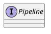

org.apache.catalina.Pipeline
## hierarchy
```
Pipeline (org.apache.catalina)
    StandardPipeline (org.apache.catalina.core)
```

## define


```java
public interface Pipeline {
    public Valve getBasic();
    public void setBasic(Valve valve);
    public void addValve(Valve valve);
    public Valve[] getValves();
    public void removeValve(Valve valve);
    public Valve getFirst();
    public boolean isAsyncSupported();
    public Container getContainer();
    public void setContainer(Container container);
    public void findNonAsyncValves(Set<String> result);
}
```

## fields


## methods