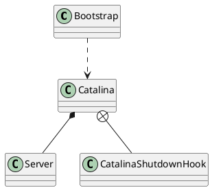

org.apache.catalina.startup.Bootstrap

## define



## methods

### start()
```java
public void start()
    throws Exception {
    if( catalinaDaemon==null ) init();

    Method method = catalinaDaemon.getClass().getMethod("start", (Class [] )null);
    method.invoke(catalinaDaemon, (Object [])null);

}

```

### init()
```java
public void init() throws Exception {

    initClassLoaders();

    Thread.currentThread().setContextClassLoader(catalinaLoader);

    SecurityClassLoad.securityClassLoad(catalinaLoader);

    // Load our startup class and call its process() method
    if (log.isDebugEnabled())
        log.debug("Loading startup class");
    Class<?> startupClass = catalinaLoader.loadClass("org.apache.catalina.startup.Catalina");
    Object startupInstance = startupClass.getConstructor().newInstance();

    // Set the shared extensions class loader 设置web应用的共享的父类加载器
    if (log.isDebugEnabled())
        log.debug("Setting startup class properties");
    String methodName = "setParentClassLoader";
    Class<?> paramTypes[] = new Class[1];
    paramTypes[0] = Class.forName("java.lang.ClassLoader");
    Object paramValues[] = new Object[1];
    paramValues[0] = sharedLoader;
    Method method =
        startupInstance.getClass().getMethod(methodName, paramTypes);
    method.invoke(startupInstance, paramValues);

    catalinaDaemon = startupInstance;

}
```
### initClassLoaders()
* commonLoader 加载$CATALINA_HOME/lib
* catalinaLoader 加载Tomcat应用服务器的类加载器
* sharedLoader 是所有WEb应用的父加载器

```java
private void initClassLoaders() {
    try {
        commonLoader = createClassLoader("common", null);
        if( commonLoader == null ) {
            // no config file, default to this loader - we might be in a 'single' env.
            commonLoader=this.getClass().getClassLoader();
        }
        catalinaLoader = createClassLoader("server", commonLoader); 
        sharedLoader = createClassLoader("shared", commonLoader);
    } catch (Throwable t) {
        handleThrowable(t);
        log.error("Class loader creation threw exception", t);
        System.exit(1);
    }
}
```
catalina.properties
```
common.loader="${catalina.base}/lib","${catalina.base}/lib/*.jar","${catalina.home}/lib","${catalina.home}/lib/*.jar"
server.loader=
shared.loader=
```

### handleThrowable()
```java
// Copied from ExceptionUtils since that class is not visible during start
private static void handleThrowable(Throwable t) {
    if (t instanceof ThreadDeath) {
        throw (ThreadDeath) t;
    }
    if (t instanceof VirtualMachineError) {
        throw (VirtualMachineError) t;
    }
    // All other instances of Throwable will be silently swallowed
}
```

错误
* Error (java.lang)
  * AWTError (java.awt)
  * AnnotationFormatError (java.lang.annotation)
  * AssertionError (java.lang)
  * CoderMalfunctionError (java.nio.charset)
  * VirtualMachineError (java.lang)
    * StackOverflowError (java.lang)
    * UnknownError (java.lang)
    * InternalError (java.lang)
    * OutOfMemoryError (java.lang)
  * ServiceConfigurationError (java.util)
  * LinkageError (java.lang)
  * IOError (java.io)
  * ThreadDeath (java.lang)
