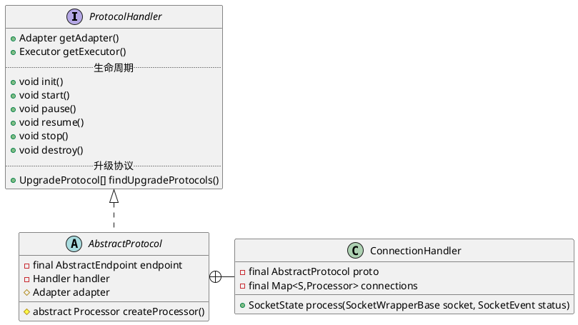

org.apache.coyote.ProtocolHandler

## hierachy
```
ProtocolHandler (org.apache.coyote)
    AbstractProtocol (org.apache.coyote)
        AbstractAjpProtocol (org.apache.coyote.ajp)
            AjpNioProtocol (org.apache.coyote.ajp)
            AjpAprProtocol (org.apache.coyote.ajp)
            AjpNio2Protocol (org.apache.coyote.ajp)
        AbstractHttp11Protocol (org.apache.coyote.http11)
            AbstractHttp11JsseProtocol (org.apache.coyote.http11)
                Http11NioProtocol (org.apache.coyote.http11)
                Http11Nio2Protocol (org.apache.coyote.http11)
            Http11AprProtocol (org.apache.coyote.http11)
```

## define

