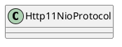

org.apache.coyote.http11.Http11NioProtocol

## hierarchy
```
AbstractProtocol (org.apache.coyote)
    AbstractHttp11Protocol (org.apache.coyote.http11)
        AbstractHttp11JsseProtocol (org.apache.coyote.http11)
            Http11NioProtocol (org.apache.coyote.http11)
                Http11Protocol (org.apache.coyote.http11)
```

## define


## fields


## methods

### construct
```java
    public Http11NioProtocol() {
        super(new NioEndpoint());
    }
```