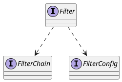

javax.servlet.Filter

## hierarchy
```
Filter (javax.servlet)
    // catalina
    FilterBase (org.apache.catalina.filters)
    GenericFilter (org.apache.catalina.servlet4preview)
    CorsFilter (org.apache.catalina.filters)
    WebdavFixFilter (org.apache.catalina.filters)
    RemoteIpFilter (org.apache.catalina.filters)
    RequestDumperFilter (org.apache.catalina.filters)
    SessionInitializerFilter (org.apache.catalina.filters)
    SSIFilter (org.apache.catalina.ssi)
    WsFilter (org.apache.tomcat.websocket.server)
    // shiro
    AbstractFilter (org.apache.shiro.web.servlet)
    // spring
    CompositeFilter (org.springframework.web.filter)
    GenericFilterBean (org.springframework.web.filter)
        OncePerRequestFilter (org.springframework.web.filter)
        DelegatingFilterProxy (org.springframework.web.filter)
    // undertow
    JsrWebSocketFilter (io.undertow.websockets.jsr)
    // alibaba
    ResourceFilter (com.alibaba.dubbo.container.page)
    WebStatFilter (com.alibaba.druid.support.http)
    StatViewFilter (com.alibaba.druid.support.http)
```

## define


```java
public interface Filter {
    public void init(FilterConfig filterConfig) throws ServletException;
    public void doFilter(ServletRequest request, ServletResponse response,
            FilterChain chain) throws IOException, ServletException;
    public void destroy();

}
```
## fields


## methods