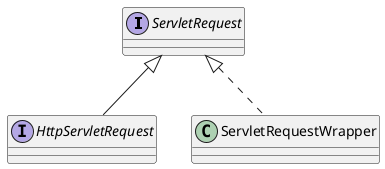

javax.servlet.ServletRequest

## Hierarchy
```
ServletRequest (javax.servlet)
    HttpServletRequest (javax.servlet.http)
        RequestFacade (org.apache.catalina.connector)
        Request (org.eclipse.jetty.server)
        Request (org.apache.catalina.connector)
        ServletRequestHttpWrapper (org.eclipse.jetty.server)
        HttpServletRequestWrapper (javax.servlet.http)
        HttpServletRequestImpl (io.undertow.servlet.spec)
        MultipartHttpServletRequest (org.springframework.web.multipart)
        MockHttpServletRequest (org.springframework.mock.web)
    ServletRequestWrapper (javax.servlet)
        ApplicationRequest (org.apache.catalina.core)
        ServletRequestHttpWrapper (org.eclipse.jetty.server)
        HttpServletRequestWrapper (javax.servlet.http)
```

## Define


```java
public interface ServletRequest {
    public Object getAttribute(String name);
    public Enumeration<String> getAttributeNames();
    public String getCharacterEncoding();
    public void setCharacterEncoding(String env) throws UnsupportedEncodingException;
    public int getContentLength();
    public long getContentLengthLong();
    public String getContentType();
    public ServletInputStream getInputStream() throws IOException; 
    public String getParameter(String name);
    public Enumeration<String> getParameterNames();
    public String[] getParameterValues(String name);
    public Map<String, String[]> getParameterMap();
    public String getProtocol();
    public String getScheme();
    public String getServerName();
    public int getServerPort();
    public BufferedReader getReader() throws IOException;
    public String getRemoteAddr();
    public String getRemoteHost();
    public void setAttribute(String name, Object o);
    public void removeAttribute(String name);
    public Locale getLocale();
    public Enumeration<Locale> getLocales();
    public boolean isSecure();
    public RequestDispatcher getRequestDispatcher(String path);
    public String getRealPath(String path);
    public int getRemotePort();
    public String getLocalName();
    public String getLocalAddr();
    public int getLocalPort();
    public ServletContext getServletContext();
    public AsyncContext startAsync() throws IllegalStateException;
    public AsyncContext startAsync(ServletRequest servletRequest,
                                   ServletResponse servletResponse)
            throws IllegalStateException;
    public boolean isAsyncStarted();
    public boolean isAsyncSupported();
    public AsyncContext getAsyncContext();
    public DispatcherType getDispatcherType();
}
```
