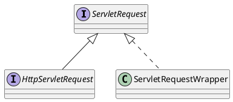

javax.servlet.http.HttpServletRequest
## Hierarchy
```
ServletRequest (javax.servlet)
    HttpServletRequest (javax.servlet.http)
        RequestFacade (org.apache.catalina.connector)
        Request (org.eclipse.jetty.server)
        Request (org.apache.catalina.connector)
        ServletRequestHttpWrapper (org.eclipse.jetty.server)
        HttpServletRequestWrapper (javax.servlet.http)
        HttpServletRequestImpl (io.undertow.servlet.spec)
        MultipartHttpServletRequest (org.springframework.web.multipart)
        MockHttpServletRequest (org.springframework.mock.web)
```
## Define


```java
public interface HttpServletRequest extends ServletRequest {
    public static final String BASIC_AUTH = "BASIC";
    public static final String FORM_AUTH = "FORM";
    public static final String CLIENT_CERT_AUTH = "CLIENT_CERT";
    public static final String DIGEST_AUTH = "DIGEST";
    public String getAuthType();
    public Cookie[] getCookies();
    public long getDateHeader(String name);
    public String getHeader(String name); 
    public Enumeration<String> getHeaders(String name); 
    public Enumeration<String> getHeaderNames();
    public int getIntHeader(String name);
    public String getMethod();
    public String getPathInfo();
    public String getPathTranslated();
    public String getContextPath();
    public String getQueryString();
    public String getRemoteUser();
    public boolean isUserInRole(String role);
    public java.security.Principal getUserPrincipal();
    public String getRequestedSessionId();
    public String getRequestURI();
    public StringBuffer getRequestURL();
    public String getServletPath();
    public HttpSession getSession(boolean create);
    public HttpSession getSession();
    public String changeSessionId();
    public boolean isRequestedSessionIdValid();
    public boolean isRequestedSessionIdFromCookie();
    public boolean isRequestedSessionIdFromURL();
    public boolean isRequestedSessionIdFromUrl();
    public boolean authenticate(HttpServletResponse response) 
	throws IOException,ServletException;
    public void login(String username, String password) 
	throws ServletException;
    public void logout() throws ServletException;
    public Collection<Part> getParts() throws IOException, ServletException;
    public Part getPart(String name) throws IOException, ServletException;
    public <T extends HttpUpgradeHandler> T  upgrade(Class<T> handlerClass)
        throws IOException, ServletException;
}
```