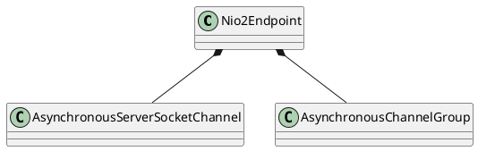

org.apache.tomcat.util.net.Nio2Endpoint

## hierarchy
```
AbstractEndpoint (org.apache.tomcat.util.net)
    AbstractJsseEndpoint (org.apache.tomcat.util.net)
        Nio2Endpoint (org.apache.tomcat.util.net)
```

## define


## fields


## methods