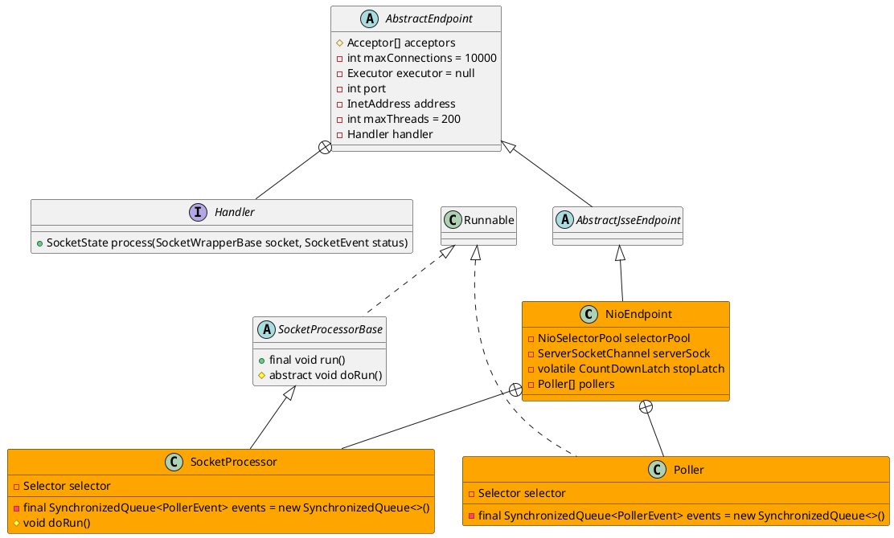

org.apache.tomcat.util.net.NioEndpoint


NIO tailored thread pool, providing the following services:
* Socket acceptor thread
* Socket poller thread
* Worker threads pool
 
## hierarchy
```
AbstractEndpoint (org.apache.tomcat.util.net)
    AbstractJsseEndpoint (org.apache.tomcat.util.net)
        NioEndpoint (org.apache.tomcat.util.net)
```

## define


## fileds

```java
    
    private int pollerThreadPriority = Thread.NORM_PRIORITY;
    private int pollerThreadCount = Math.min(2,Runtime.getRuntime().availableProcessors());
    private Poller[] pollers = null;
    private AtomicInteger pollerRotater = new AtomicInteger(0);
```

## methods

### bind
```java
    @Override
    public void bind() throws Exception {

        serverSock = ServerSocketChannel.open();
        socketProperties.setProperties(serverSock.socket());
        InetSocketAddress addr = (getAddress()!=null?new InetSocketAddress(getAddress(),getPort()):new InetSocketAddress(getPort()));
        serverSock.socket().bind(addr,getAcceptCount());
        serverSock.configureBlocking(true); //mimic APR behavior

        // Initialize thread count defaults for acceptor, poller
        if (acceptorThreadCount == 0) {
            // FIXME: Doesn't seem to work that well with multiple accept threads
            acceptorThreadCount = 1;
        }
        if (pollerThreadCount <= 0) {
            //minimum one poller thread
            pollerThreadCount = 1;
        }
        setStopLatch(new CountDownLatch(pollerThreadCount));

        // Initialize SSL if needed
        initialiseSsl();

        selectorPool.open();
    }
```