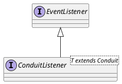

io.undertow.conduits.ConduitListener

## hierarchy
```
ConduitListener (io.undertow.conduits)
    1 in HttpTransferEncoding (io.undertow.server.protocol.http)
    1 in HttpClientConnection (io.undertow.client.http)
    1 in AjpReadListener (io.undertow.server.protocol.ajp)
```

## define
