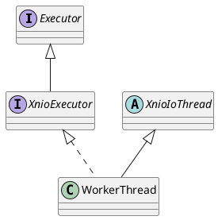

org.xnio.XnioExecutor

## hierarchy
```
XnioExecutor (org.xnio)
    WorkerThread (org.xnio.nio)
    XnioIoThread (org.xnio)
        WorkerThread (org.xnio.nio)
```

## define

```plantuml
@startuml

interface Executor
interface XnioExecutor
class WorkerThread

Executor ^-- XnioExecutor
XnioExecutor ^.. WorkerThread

abstract class XnioIoThread
XnioIoThread ^-- WorkerThread

@enduml
```