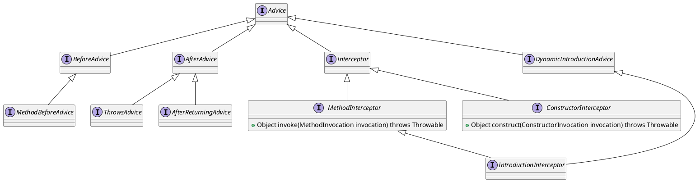

org.aopalliance.aop.Advice

## hierachy
```
Advice (org.aopalliance.aop)
    Interceptor (org.aopalliance.intercept)
        MethodInterceptor (org.aopalliance.intercept)
            AbstractSlsbInvokerInterceptor (org.springframework.ejb.access)
            MethodValidationInterceptor (org.springframework.validation.beanvalidation)
            BurlapClientInterceptor (org.springframework.remoting.caucho)
            EventPublicationInterceptor (org.springframework.context.event)
            PersistenceExceptionTranslationInterceptor (org.springframework.dao.support)
            JndiContextExposingInterceptor in JndiObjectFactoryBean (org.springframework.jndi)
            AbstractTraceInterceptor (org.springframework.aop.interceptor)
            IntroductionInterceptor (org.springframework.aop)
            RmiClientInterceptor (org.springframework.remoting.rmi)
            HessianClientInterceptor (org.springframework.remoting.caucho)
            AspectJAfterThrowingAdvice (org.springframework.aop.aspectj)
            ThrowsAdviceInterceptor (org.springframework.aop.framework.adapter)
            CacheInterceptor (org.springframework.cache.interceptor)
            ExposeBeanNameInterceptor in ExposeBeanNameAdvisors (org.springframework.aop.interceptor)
            ExposeInvocationInterceptor (org.springframework.aop.interceptor)
            JaxWsPortClientInterceptor (org.springframework.remoting.jaxws)
            AopAllianceAnnotationsAuthorizingMethodInterceptor (org.apache.shiro.spring.security.interceptor)
            AsyncExecutionInterceptor (org.springframework.aop.interceptor)
            TransactionInterceptor (org.springframework.transaction.interceptor)
            ConcurrencyThrottleInterceptor (org.springframework.aop.interceptor)
            JndiRmiClientInterceptor (org.springframework.remoting.rmi)
            RemoteInvocationTraceInterceptor (org.springframework.remoting.support)
            AfterReturningAdviceInterceptor (org.springframework.aop.framework.adapter)
            AspectJAfterAdvice (org.springframework.aop.aspectj)
            AspectJAroundAdvice (org.springframework.aop.aspectj)
            HttpInvokerClientInterceptor (org.springframework.remoting.httpinvoker)
            GenericMessageEndpoint in GenericMessageEndpointFactory (org.springframework.jca.endpoint)
            MBeanClientInterceptor (org.springframework.jmx.access)
            ControllerMethodInvocationInterceptor in MvcUriComponentsBuilder (org.springframework.web.servlet.mvc.method.annotation)
            MethodBeforeAdviceInterceptor (org.springframework.aop.framework.adapter)
        ConstructorInterceptor (org.aopalliance.intercept)
    BeforeAdvice (org.springframework.aop)
        MethodBeforeAdvice (org.springframework.aop)
    DynamicIntroductionAdvice (org.springframework.aop)
        IntroductionInterceptor (org.springframework.aop)
    AbstractAspectJAdvice (org.springframework.aop.aspectj)
    AfterAdvice (org.springframework.aop)
        AfterReturningAdviceInterceptor (org.springframework.aop.framework.adapter)
        ThrowsAdvice (org.springframework.aop)
        AspectJAfterAdvice (org.springframework.aop.aspectj)
        AspectJAfterReturningAdvice (org.springframework.aop.aspectj)
        AspectJAfterThrowingAdvice (org.springframework.aop.aspectj)
        ThrowsAdviceInterceptor (org.springframework.aop.framework.adapter)
        AfterReturningAdvice (org.springframework.aop)
```

## Advice 定义
在特定的连接点，AOP框架执行的动作。

* 前置通知 BeforeAdvice MethodBeforeAdvice
* 后置通知、异常通知、环绕通知
* 动态织入通知 织入拦截器
* 通知理解为拦截，拦截器继承了通知，有构造方法拦截器、普通方法拦截器



## Advice 类图

```yuml
// {type:class}

[Advice]
[BeforeAdvice{bg:thistle}]
[AfterAdvice{bg:whitesmoke}]
[DynamicIntroductionAdvice{bg:wheat}]
[Interceptor{bg:tomato}]

// 1. before通知 方法前通知
[Advice]^-[BeforeAdvice]
[BeforeAdvice]^-[MethodBeforeAdvice]

// 2. after通知 异常、返回通知
[Advice]^-[AfterAdvice]
[AfterAdvice]^-[ThrowsAdvice]
[AfterAdvice]^-[AfterReturningAdvice]

// 3. interceptor 拦截器
[Advice]^-[Interceptor]
[Interceptor]^-[MethodInterceptor]
[Interceptor]^-[ConstructorInterceptor]

// 4. 动态织通知 织入拦截器
[Advice]^-[DynamicIntroductionAdvice]
[DynamicIntroductionAdvice]^-[IntroductionInterceptor]

// 注释
[note:定义在连接点做什么，为切面增强提供织入接口{bg:cornsilk}]
[Interceptor]-.-[note:通知是对拦截器更高级别的抽象{bg:cornsilk}]
```